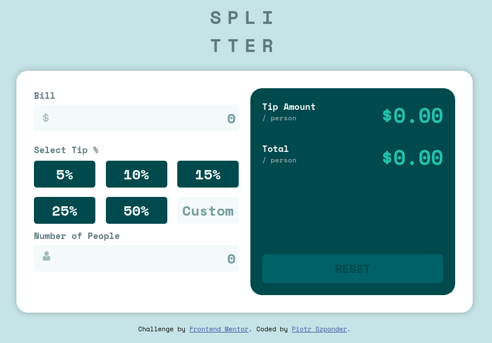

# Frontend Mentor - Tip calculator app solution

This is a solution to the [Tip calculator app challenge on Frontend Mentor](https://www.frontendmentor.io/challenges/tip-calculator-app-ugJNGbJUX). Frontend Mentor challenges help you improve your coding skills by building realistic projects.

## Table of contents

- [Overview](#overview)
  - [The challenge](#the-challenge)
  - [Screenshot](#screenshot)
  - [Links](#links)
- [My process](#my-process)
  - [Built with](#built-with)
  - [What I learned](#what-i-learned)
  - [Useful resources](#useful-resources)
- [Author](#author)

**Note: Delete this note and update the table of contents based on what sections you keep.**

## Overview

### The challenge

Users should be able to:

- View the optimal layout for the app depending on their device's screen size
- See hover states for all interactive elements on the page
- Calculate the correct tip and total cost of the bill per person

### Screenshot

### Links

- Solution URL: [https://www.frontendmentor.io/solutions/mobile-first-solution-using-flexbox-bem-and-keyframe-animations-ow_q5a06Q](https://www.frontendmentor.io/solutions/mobile-first-solution-using-flexbox-bem-and-keyframe-animations-ow_q5a06Q)
- Live Site URL: [https://pszponder.github.io/fem-tip-calculator-app-main/](https://pszponder.github.io/fem-tip-calculator-app-main/)

## My process

### Built with

- Semantic HTML5 markup
- CSS custom properties
- Flexbox
- Mobile-first workflow

### What I learned

In this project, I learned about using pseudo-elements in order to add content via css. I used the `:before` and `:after` pseudo-elements to insert the dollar and person icons into the inputs.

I also learned about how to use `absolute` and `relative` positioning in conjunction with the pseudo-element to properly align the icons. In order to properly align a pseudo-element, it needs to have a position of `absolute` and its parent needs a positioning of `relative`. Selecting either `absolute` or `relative` positioning also allows you to use z-indexing properly.

The knowledge I gained by using pseudo-elements and relative and absolute positioning helped me properly place the error messages when an invalid input occurred.

From the JavaScript perspective, I learned to use the `document.querySelector()` method instead of using `document.getElementByID` or `document.getElementByClassname`. Since `querySelector()` works with CSS selectors, you can use it to pick any element in the DOM and this is not only very powerful, but also cleans up your code in my opinion.

### Useful resources

- [Kevin Powell - Before and After Pseudo Elements Explained](https://www.youtube.com/watch?v=zGiirUiWslI) - This series of videos by Kevin helped me understand the basics of pseudo-elements which I then used to insert the dollar sign and person symbol in my Bill and Number of People inputs.

- [Kevin Powell - CSS Positioning: Position absolute and relative explained](https://www.youtube.com/watch?v=P6UgYq3J3Qs) - In order to understand how to position the before and after pseudo-elements, I watched Kevin's video on absolute vs relative position and in conjuction with his videos on pseudo-elements, learned how to properly position the pseudo elements.

## Author

- GitHub - [@pszponder](https://github.com/pszponder)
- Frontend Mentor - [@pszponder](https://www.frontendmentor.io/profile/pszponder)
- Twitter - [@PSzponder](https://twitter.com/PSzponder)
